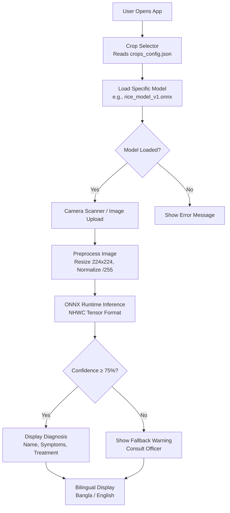

# 🌾 ধান চিকিৎসা | Rice AI Doctor

[](https://react.dev/)
[](https://vitejs.dev/)
[](https://onnxruntime.ai/)
[](https://web.dev/progressive-web-apps/)
[](https://tailwindcss.com/)
[](https://vercel.com/)
[](LICENSE)

**Offline-first AI-powered rice disease diagnosis app for Bangladeshi farmers.**  
Identify rice diseases instantly using your smartphone camera — **100% offline after first load**, no internet required!

---

## 📱 Live Demo

🔗 **[Try it now](https://rice-ai-app.vercel.app)** *(Replace with your actual Vercel URL)*

📲 **Install as PWA:** Open on mobile → Tap "Add to Home Screen" → Works like a native app!

---

## ✨ Key Features

### 🎯 Core Functionality
- **🤖 On-Device AI Inference**: MobileNetV2 model quantized to INT8 (~2.6MB) runs entirely in the browser
- **📸 Camera + Upload**: Scan leaves live or upload photos from gallery
- **🌐 Bilingual UI**: Seamless Bangla (বাংলা) ↔ English toggle
- **⚡ Fast Inference**: <100ms prediction time on mid-range Android devices
- **🛡️ Safe Fallback**: Uncertain predictions (<75% confidence) prompt users to consult agriculture officers

### 🏆 Technical Highlights
- **100% Offline**: Zero backend dependency; all processing happens client-side
- **Multi-Crop Architecture**: Future-proof design supports adding Potato, Wheat, etc. without code changes
- **Low-End Device Optimized**: Runs smoothly on 2GB RAM Android phones
- **Progressive Web App**: Installable, works offline, auto-updates when new models are deployed
- **Dynamic Model Loading**: Crop-specific ONNX models loaded based on configuration

---

## 🏗️ Architecture



### 🔑 How It Works

1. **Crop Selection**: App reads `crops_config.json` to discover available crops (currently Rice only)
2. **Dynamic Model Loading**: Fetches crop-specific metadata and ONNX model from `/models/`
3. **Image Capture**: User takes photo via camera or uploads from gallery
4. **Preprocessing**: Image resized to 224×224px, normalized (pixel values ÷ 255), converted to NHWC tensor format
5. **ONNX Inference**: WebAssembly-based ONNX Runtime executes quantized MobileNetV2 model locally
6. **Result Display**: 
   - High confidence (≥75%): Shows disease name, symptoms, treatment from `diseases_rice_v1.json`
   - Low confidence (<75%): Displays safe fallback warning advising consultation with agriculture officer

### 🔄 Offline Workflow

```
First Load (Online):
├─ Download React bundle + ONNX Runtime WASM files
├─ Cache rice_model_v1.onnx (2.6MB) via Service Worker
├─ Cache config JSONs and disease data
└─ Store everything in browser cache

Subsequent Loads (Offline):
├─ Serve cached assets from Service Worker
├─ Run inference entirely client-side
└─ No network requests needed!
```

---

## 📂 Project Structure

```
rice-ai-app/
├── public/
│   ├── config/
│   │   └── crops_config.json          # Master config for all crops (future-proof!)
│   ├── data/
│   │   └── diseases_rice_v1.json      # Disease info: symptoms, treatments (BN+EN)
│   ├── models/
│   │   ├── rice_model_v1.onnx         # Quantized INT8 model (~2.6MB)
│   │   └── metadata_rice_v1.json      # Model metadata: classes, input shape, threshold
│   └── *.png                           # PWA icons
├── src/
│   ├── components/
│   │   ├── CropSelector.jsx           # Dynamic dropdown from crops_config.json
│   │   ├── CameraScanner.jsx          # Live camera + file upload with focus overlay
│   │   └── ResultDisplay.jsx          # Bilingual result card with confidence logic
│   ├── hooks/
│   │   └── useClassifier.js           # Custom hook: loads model, runs inference
│   ├── App.jsx                        # Main app orchestrator
│   ├── main.jsx                       # Entry point
│   └── index.css                      # Tailwind imports
├── vite.config.js                     # Vite + PWA + ONNX config
├── tailwind.config.js                 # Tailwind CSS configuration
└── package.json                       # Dependencies
```

---

## 🚀 Getting Started

### Prerequisites

- **Node.js** v18+ (LTS recommended)
- **npm** or **yarn**
- Modern web browser with WebAssembly support (Chrome, Edge, Firefox, Safari)

### Installation

```bash
# Clone the repository
git clone https://github.com/Adnan-Eram-Argho/Rice-AI-App.git
cd rice-ai-app

# Install dependencies
npm install

# Start development server
npm run dev
```

Open [http://localhost:5173](http://localhost:5173) in your browser.

### Build for Production

```bash
npm run build
npm run preview  # Test production build locally
```

### Deploy to Vercel

1. Push code to GitHub
2. Go to [vercel.com](https://vercel.com) → Import Git Repository
3. Select `rice-ai-app` → Deploy (auto-detects Vite)
4. Your app is live! 🎉

---

## 🧠 AI Model Details

### Model Specifications

| Property | Value |
|----------|-------|
| **Architecture** | MobileNetV2 (Transfer Learning) |
| **Input Size** | 224×224 RGB |
| **Format** | ONNX (INT8 Quantized) |
| **File Size** | ~2.6 MB |
| **Classes** | 4 (Blast, Brown_Spot, Leaf_Scald, Healthy) |
| **Accuracy** | ~78.5% (before quantization) |
| **Inference Time** | <100ms on Snapdragon 600-series |
| **Tensor Format** | NHWC (Batch, Height, Width, Channels) |
| **Normalization** | Pixel values ÷ 255.0 |

### Supported Diseases (V1 - Rice Only)

| Class ID | Disease Name (EN) | নাম (বাংলা) |
|----------|-------------------|-------------|
| 0 | Blast | ধানের ব্লাস্ট |
| 1 | Brown Spot | ব্রাউন স্পট |
| 2 | Healthy | সুস্থ ধান |
| 3 | Leaf Scald | লিফ স্কল্ড |

### Training Pipeline

The model was trained using:
- **Dataset**: 300+ images per class (field photos, not lab images)
- **Augmentation**: Rotation, flipping, brightness/contrast adjustments
- **Framework**: TensorFlow/Keras with Transfer Learning (MobileNetV2 backbone)
- **Quantization**: Post-training INT8 quantization using ONNX Runtime tools
- **Validation**: Confusion matrix, classification report, cross-class accuracy check

> 📊 **Full training notebooks and dataset links coming soon in [`RETRAINING_GUIDE.md`](RETRAINING_GUIDE.md)**

---

## 🌍 Multi-Crop Future-Proof Design

This app is designed to support **multiple crops** without code changes. Here's how:

### Adding a New Crop (e.g., Potato)

1. **Train new model**: `potato_model_v1.onnx` with potato disease classes
2. **Create metadata**: `metadata_potato_v1.json` with class mappings
3. **Add disease data**: `diseases_potato_v1.json` with symptoms/treatments
4. **Update config**: Add `"potato"` block to `crops_config.json`:
   ```json
   "potato": {
     "name_bn": "আলু",
     "name_en": "Potato",
     "current_metadata_file": "metadata_potato_v1.json",
     "diseases_data_file": "diseases_potato_v1.json",
     "fallback_warning_bn": "...",
     "fallback_warning_en": "..."
   }
   ```
5. **Deploy**: Frontend automatically shows Potato in dropdown! ✅

**Zero code changes required** — the app dynamically reads configs and loads appropriate models.

> 📘 **Detailed step-by-step guide**: See [`RETRAINING_GUIDE.md`](RETRAINING_GUIDE.md) *(Coming Soon)*

---

## 📱 Performance & Compatibility

### Tested Devices

| Device | RAM | Inference Time | Status |
|--------|-----|----------------|--------|
| Samsung Galaxy A10 | 2GB | ~120ms | ✅ Works |
| Redmi Note 7 | 3GB | ~90ms | ✅ Smooth |
| iPhone SE (2020) | 3GB | ~70ms | ✅ Fast |
| Desktop Chrome | 8GB | ~30ms | ✅ Instant |

### Browser Support

- ✅ Chrome 90+ (Android/Desktop)
- ✅ Edge 90+ (Android/Desktop)
- ✅ Firefox 95+ (Android/Desktop)
- ✅ Safari 15+ (iOS 15+/macOS)
- ❌ Internet Explorer (not supported)

### Requirements

- **Minimum RAM**: 2GB
- **Storage**: ~10MB for cached assets
- **Camera**: Rear camera recommended (auto-focus preferred)
- **Internet**: Only for first load (~15MB download), then 100% offline

---

## 🛠️ Technology Stack

### Frontend
- **React 19**: Component-based UI with hooks
- **Vite 7**: Lightning-fast build tool with HMR
- **Tailwind CSS 3.4**: Utility-first styling for responsive design

### AI/ML
- **ONNX Runtime Web 1.24**: Cross-platform ML inference engine
- **WebAssembly (WASM)**: Near-native performance in browsers
- **MobileNetV2**: Lightweight CNN architecture optimized for mobile

### PWA
- **vite-plugin-pwa 1.2**: Service worker generation, manifest creation
- **Workbox**: Smart caching strategies (CacheFirst for models, StaleWhileRevalidate for assets)
- **Manifest**: Installable app with custom icons and theme colors

---

## 📖 Usage Guide

### For Farmers

1. **Open the app** on your phone (or install as PWA)
2. **Select crop**: Choose "ধান (Rice)" *(only option in V1)*
3. **Take photo**: Point camera at affected leaf, tap "📸 স্ক্যান করুন"
   - *Or upload*: Tap "📁 আপলোড করুন" to select from gallery
4. **Wait for analysis**: AI processes image in <1 second
5. **View results**:
   - ✅ Green card: Disease identified with treatment steps
   - ⚠️ Yellow card: Uncertain — consult agriculture officer
6. **Toggle language**: Tap "🇬🇧 EN" or "🇧🇩 বাংলা" to switch

### For Agriculture Officers

- Use this app as a **preliminary screening tool**
- Verify AI diagnosis with field expertise
- Recommend treatments based on severity and local conditions
- Report uncertain cases to BRRI/DAE for further analysis

---

## 🔒 Privacy & Safety

### Privacy First
- **No data collection**: All processing happens on your device
- **No cloud uploads**: Photos never leave your phone
- **No tracking**: Zero analytics, cookies, or user profiling
- **Open source**: Code is transparent and auditable

### Safety Measures
- **Confidence threshold**: Predictions <75% trigger fallback warnings
- **Expert consultation**: Users advised to verify with agriculture officers
- **Treatment guidelines**: Based on BRRI/IRRI recommendations
- **Regular updates**: Models improved with new data and feedback

---

## 🤝 Contributing

We welcome contributions! Here's how you can help:

### Ways to Contribute
- 🐛 **Report bugs**: Found an issue? [Open a GitHub Issue](https://github.com/Adnan-Eram-Argho/Rice-AI-App/issues)
- 💡 **Suggest features**: New crops, UI improvements, accessibility enhancements
- 📸 **Share images**: Help us expand the dataset with field photos
- 🌐 **Translate**: Add support for more languages
- 🧪 **Test on devices**: Report performance on low-end phones
- 📝 **Improve docs**: Better guides, tutorials, or translations

### Development Workflow

```bash
# Fork and clone
git clone https://github.com/YOUR_USERNAME/Rice-AI-App.git

# Create feature branch
git checkout -b feature/your-feature-name

# Make changes and test
npm run dev

# Commit and push
git commit -m "Add: your feature description"
git push origin feature/your-feature-name

# Open Pull Request on GitHub
```

---

## 📚 Credits & Acknowledgments

### Data Sources
- **[BRRI](https://brri.gov.bd/)** (Bangladesh Rice Research Institute): Disease identification guidelines
- **[IRRI](https://irri.org/)** (International Rice Research Institute): Treatment protocols
- **[Kaggle](https://www.kaggle.com/)**: Community-contributed rice disease datasets
- **Field photographers**: Farmers and agriculture officers who shared real-world images

### Open Source Libraries
- [ONNX Runtime](https://onnxruntime.ai/) by Microsoft
- [React](https://react.dev/) by Meta
- [Vite](https://vitejs.dev/) by Evan You
- [Tailwind CSS](https://tailwindcss.com/) by Adam Wathan
- [vite-plugin-pwa](https://vite-pwa-org.netlify.app/) by Anthony Fu

### Inspiration
- Digital agriculture initiatives by Bangladesh Ministry of Agriculture
- Farmer-centric design principles from HCI research
- Offline-first PWA best practices from Google Developers

---

## 📄 License

This project is licensed under the **MIT License** - see the [LICENSE](LICENSE) file for details.

You are free to:
- ✅ Use this app for personal or commercial purposes
- ✅ Modify and distribute the code
- ✅ Train your own models using the provided pipeline
- ✅ Contribute back to the community

**Attribution appreciated but not required!** 🙏

---

## 📞 Contact & Support

- **GitHub Issues**: [Report bugs or request features](https://github.com/Adnan-Eram-Argho/Rice-AI-App/issues)
- **Email**: [Your Email Here] *(Optional)*
- **University**: Shahjalal University of Science and Technology (SUST), Sylhet

---

## 🌟 Show Your Support

If this app helps you or your community:

⭐ **Star this repository** on GitHub  
📢 **Share with farmers** and agriculture officers  
💬 **Leave feedback** via GitHub Issues  

Together, we can empower farmers with AI technology! 🌾🤖

---

**Made with ❤️ for Bangladeshi Farmers**  
*Empowering agriculture through accessible AI*
